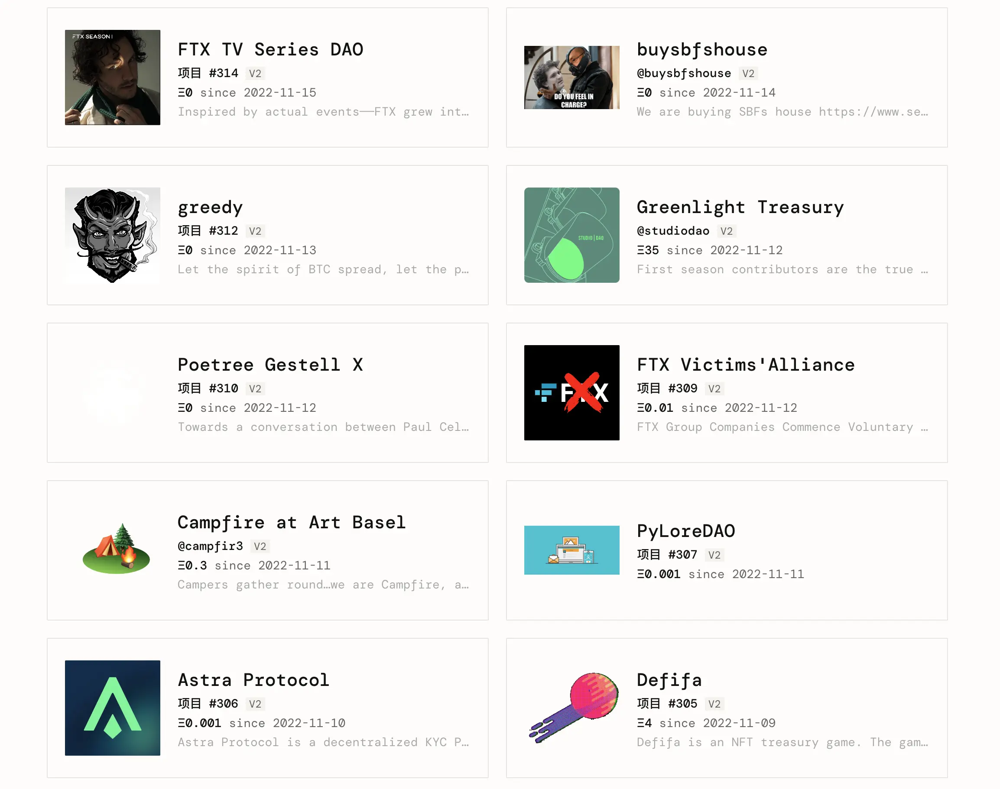
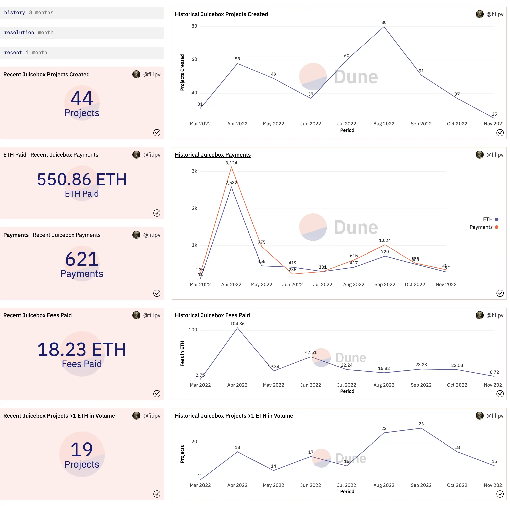
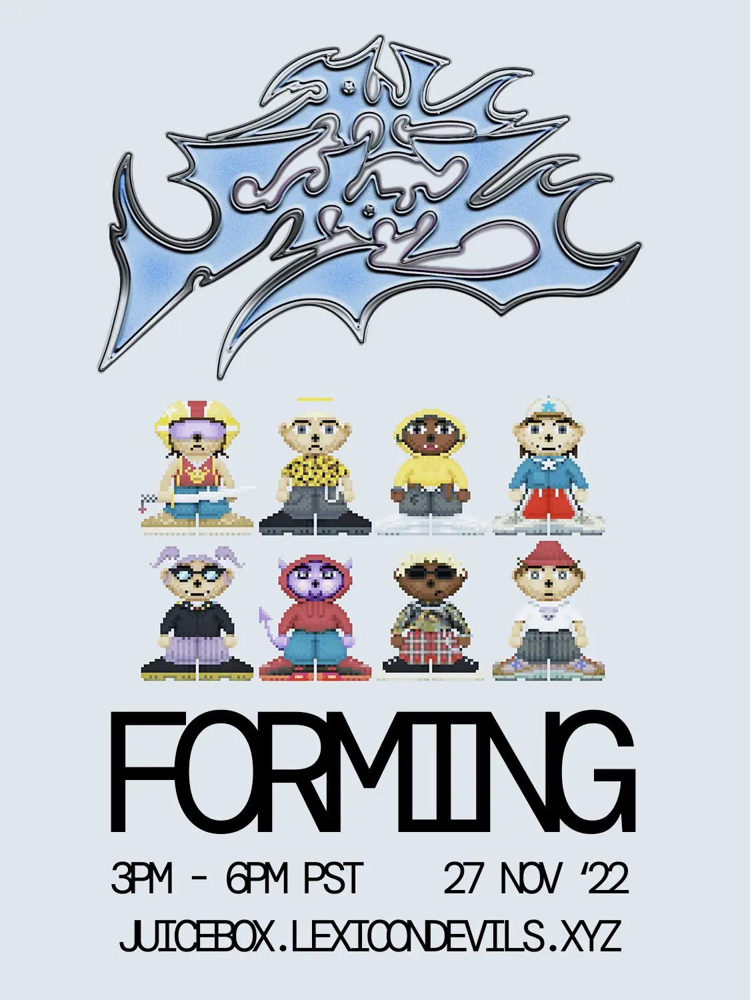
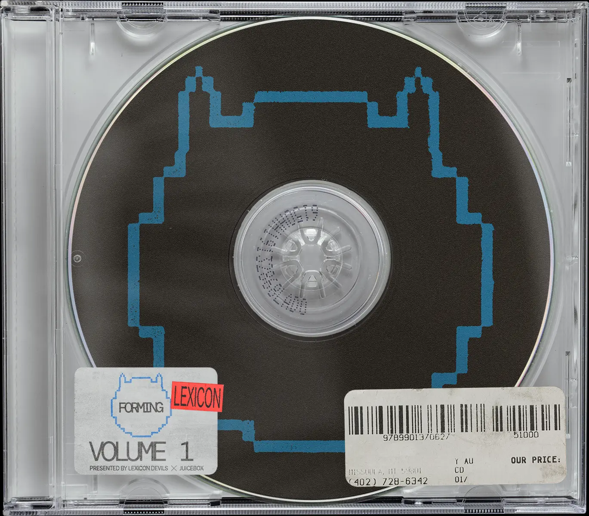

 
Art by [Sage Kellyn](https://twitter.com/SageKellyn)

## Frontend Update by Peel team

- Our NFT functionality is live, we've got quite a few new projects on mainnet using the NFT rewards
- Initial V2 > V3 upgrade path is coming this week, V2 projects will be able to launch their funding cycle on V3 soon.
- The priorities of Peel in this and next week will be bug squashing and continued integration of feedback into project creation flow.
- Some new subgraph updates upcoming this week, hopefully we'll  have funding cycle events appearing onto the project activity feed in the next two weeks.
- Shout out and thank you to the DAO for supporting Peel's payout renewal proposal in the current governance cycle.

## Defifa Update with Jango

Because we are trying to figure out how to continue spreading the word and telling the story of [Defifa](https://www.defifa.net/), Jango wrote a [blog post about Defifa](https://info.juicebox.money/blog/2022-11-14-defifa) the other day explaining three of the novel technical components.

1. Firstly, The NFT rewards mechanism, being part of the protocol, could be attached to any project upon launching now, or attached to a future funding cycle. Defifa uses this mechanism to define 32 NFT tiers  that are corresponding with the 32 teams that will be playing in the FIFA World Cup, all with the price 0.022 ETH. 

    That's all resuing a bunch of stuff that everyone has access to within the NFT rewards contract. Hopefully a lot of these extra nuggets of features will be coming to juicebox.money as weil, so that folks can have access to things like reserved rates and the governance aspect of tokens as well. 

2. The second interesting aspect that Defifa builds from is the idea of project ownership. 

    Normally, project owners of Juicebox projects are a person or a multisig that has the exclusive ability to reconfigure the project's funding cycles. But in the case of Defifa, it's owned by a contract, which means no one has control over its reconfigurations. Four funding cycles have been pre-configured into the contract to represent each of the 4 phases of Defifa, which can be queued by anyone in the public before the current phase ends.  All the timestamps that define the game start and couple other time bounds have been decided on the game's initialization.

    The entire life cycle of Defifa is basically unowned in a contract. It's an open design space that we're just starting to play with, but obviously it helps to have an end application in mind when you're thinking about how to leverage these tools. Jango hopes that this contract and this idea can serve inspiraton for folks who want to experiment more over time.

3. The 3rd and last bit that's interesting about Defifa, which is new and unseen before, is the idea of governance with the use of a scorecard. Each NFT minted actually can be used to vote on a particular set of decisions, and Defifa scopes it down to one decision which is the result in real life. 

    At the end of the tournament, token holders are responsible for attesting to the results of the competition, which is basically how should the treasury be split. Anyone can submit a scorecard and NFT holder will be expected to send a transaction onchain to attest to the correct scorecard. 
    
    Once the correct scorecard is ratified, the treasury will re-open so that NFTs can be redeemed for the underlying treasury according to this scorecard.

As far as attestation is concerned, each of the 32 teams has 1 vote to attest to the correct socorecard.  Each NFT, each unit within the same team has a fraction of that 1 vote. So if there are 300 Brazil NFTs, each of them has 1/300 of the vote to attest to the correct scorecard. There might be some corruption manipulation opportunities if someone amasses 50% of all voting power, which is required to actually confirm and ratify the scorecard. There might be incentives for people to mint the least minted teams to get higher proportionate voting power.

Jango also thought it's awesome to see the [project page](https://juicebox.money/v2/p/305) on juicebox.money.  Currently the project create flow only allows 3 NFT tiers, but the protocol acutally supports open-ended number of tiers. So he suggested that we should prioritize to stretch what's reasonable in frontend's perspective for juicebox.money, which should be more healthy as we don't want to spend much time building something that no one's really putting too much stress on. 

Jango was quite sure we would learn more about the parameters that we chose to initialize this game, and excited to run it again with new artwork and maybe some variable version of this site for the Women's World cup next year. 

## V3 Report by Jango

Compared with shift from V1 to V2, which was a quite significant one that opened up the creativity within Juicebox protocol, the shift from V2 to V3 is just a small change that patched up some minor issues from the audit report on V2. 

JuiceboxDAO is going to put most stress on the migration system. Over the next two months, hopefully by the end of January, we'll have cleaned out the V1 and V2 allocation and moved everything to V3, as well as started the process of moving the V1 JBX into an iterated version of JBX.  There will be more details coming on the JBX situation next week, as discussions are unfolding right now in the Protocol channel.

We want to only use the V3 treasury for JuiceboxDAO in the future, and  we can set one payout on V1 treasury and one on V2 treasury. Anyone can call `distribute` anytime in those treasuries and funds over there will be moved to V3. So we can still receive payments or collect fees from those two treasuries, those funding cycles will carry on. Eventually we can turn them off if we choose to, and also turn off fees in those environments, but that should be a disscussion for another day.

The goal here is to converge on V3 operation from a contractual perspective, and meanwhile give frontend more time to keep finessing all the stuff added lately. There are a lot of little improvement to make, things to research and better understand, which takes time.

If projects on V2 choose to upgrade to V3, they get to keep the ownership NFT of their project so they don't have to create a new project on V3. But they will need to initiate new funding cycles and issue new tokens, which are things versioned from V2 to V3. You can either manage both at the same time, or you have the option to pause those funding cycles on V2 and take the project entirely onto V3. Although the scenario for Juicebox projects will be more complex due to the 3 treasuries it has across V1, V2 and V3, as well as the token migrations to make, but for most other projects, they can just start a new funding cycle on V3 and stop the one on V2, then mint and airdrop new tokens to their current holders.

## Protocol analytics with Filipv

Filipv made a [Dune dashboard](https://dune.com/filipv/juiceboard) for purpose of analysing the statistics of Juicebox protocol. It shows figures for the past 30 days on the left hand side, and historical context on the right-hand side.

In the past 30 days, we have 44 projects deployed, which is above the numbers in October but still quite below that of the historical average. The situation is similar with payments, in terms of either the number of payments, or the amount of payments.

And we have approximately 20 ETH paid to JuiceboxDAO as fees across all the protocol versions in this interval. Another figure is much higher than last month and also the historical average, which is the numbers of active projects with payment volume above 1 ETH.

### Discussion about Juicebox fees

**Filipv**: 
I think it's worth considering that fees are only generated when projects actually make distribtutions, which usually means either they're sending the funds somewhere else, or they're making payouts to contributors. The more we can do to track DAOs actually running their operations, the better it will be in terms of fee generation.

**Nicholas**:
I love the feature that projects don't pay fees when they're paying each other in the Juicebox protocol, so they might want to pay all of their service providers within the ecosystem in a certain way, which is cool.

**Jango**: 
It's useful to keep track of these different metrics. But it's really hard to say which metrics will be of utmost importance, especially at this point when we're still trying to find games that work and ways to express them. Let's just say in the craziest circumstances, you have the entire world operating on Juicebox treasuries and just sending funds from one treasury to another. There will be no fees generated, but all potential energy instead. It's like all value locked in the contracts. At the end of the day, it's not really about fees, if activities happening between projects, it's even better. People aren't paying fees and it kind of sits as this future cash flow proposition for the protocol, which I think it actually more exciting. You have a different way to think about what success means in that context.

**Filipv**:
I think it's interesting to look at the way different metrics correlate and the way they don't. Project creations and payments seem to correlate pretty strongly. But fees don't seem to be as strongly correlated, so distributions don't seem to be as strongly correlated with those two numbers, neither does the number of projects with volume over 1 ETH. Often times , it seems when there's a big surge in payments, a lot of people will create projects as a result of the hype, but not all of those projects will actually lead to sustainable communities. So it will be worth considering that a metric like numbers of projects created can be a littile bit reductive because it doesn't speak to the amount of projects which are serious building.

**jango**: 
I think we have to keep reminding ourselves that the point of fees aren't to extend and grow the availability of our payouts. It creates the energy that can help propel any number of future projects. I think we have to answer in an extremely long-term vision of what the right fee structure or amount is.  It's interesting to consider how the fees play out. Personally I feel pretty confident the goal isn't to accumulate and keep spending payouts, the fees don't give us the permission to expand payouts in a sense. It's all really just accumulating to the JBX energy and then servicing future fundraisers.

## StudioDAO Launch with Kenbot

[StudioDAO](https://www.studiodao.xyz/) has launched this week. They're going to hold their first town hall on Thursday at 1:00 Pacific time. They want to show that there's good distribution and people are coming in. 

Now that StudioDAO is up and running with its first treasury, they have the goal to raise 100 ETH in the first month to get this all working.

Next step, they're going to hold a vote, to admit their first couple of films. There's a Alien-To-Me project and  something coming along. They now have a proposal in with MoonDAO that looks coming along well. If this proposal gets voted in, they will be funding the MoonDAO documentary, which is super cool and kind of the perfect project for them.

Kenbot also said that this is a non-FOMO project, so there are no hard deadlines for buying the tokens. But,  it should be the earlier the better. If people buy into the [StudioDAO Greenlight Treasury](https://juicebox.money/v2/p/311) right now, the issuance rate is 1,000,000 tokens per ETH with 20% reserve rate, which means contributors can get 80% of the tokens minted from the payment. But when they launch the film projects, the reserve rates of those projects will be 50%. 

Also Kenbot is trying to collaborate with Jigglyjams to essentially incentivize temperature checks for the broader community, where they will keep track of who is participating in  those temp checks with Nance, and in the future do claims or airdrops or something of additional greenlight power for people who are participating in the governance.

## Lexicon Devils and Forming Update with Darbytrash

On November 27th, Lexicon Devils will be doing Forming collab with ALLSTARZ. For anyone who wants to take a look at the ALLSTARZ collection, you can click [here](https://allstarz.world/).

They're going to do something special for ALLSTARZ NFT holders. The winners of the [raffle on Twitter](https://twitter.com/allstarz_nft/status/1592274671520874496) can have their ALLSTARZ NFTs voxelized by Wackozacco so that they can wear it at the abovementioned Forming party very soon.

[The Forming mixtape](https://soundcloud.com/lexicondevils/forming-mixtape-vol-1), which is still a work in progress, will be coming real soon.

## Felixander's Town Hall Game

Felixander talked to three of our community members, Jigglyjam, Gogo and Viraz, and asked them the same question: "How would Banny get his funds out of FTX right now?"

They responded, in no particular order, with:  

- "he would disguise himself as shit, hide himself in SBF's toilet, then when SBF is taking a shit he will get inside of SBF though his anus... so you could say banny would fuck him up, then travel to SBF's cerebellum and take over his actions. He will then get in his account and get back his accounts and people that liked the this tweet. oh and he would share their private keys."  

- "Setup a thrinder (tinder for thirds) account and go on a date with Sam and Caroline. He finds SBFs private key storage safe, cracks it and send everyone their money back" 

- "funds are gone ser."

And folks in the town hall are supposed to guess:

The answer is ... Jigglyjams.
