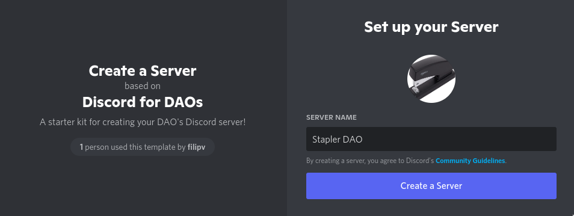
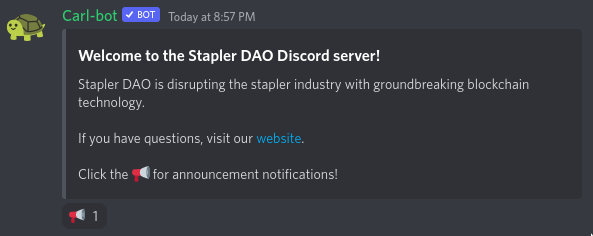
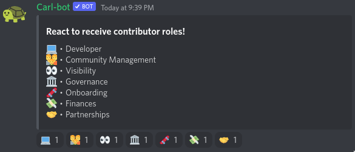
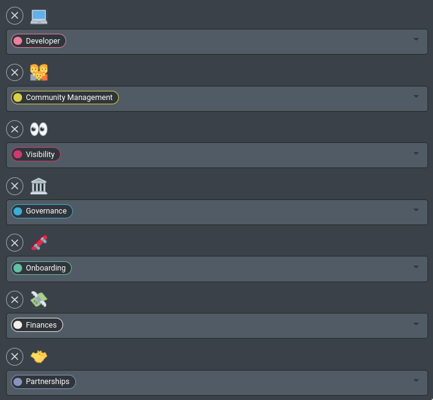
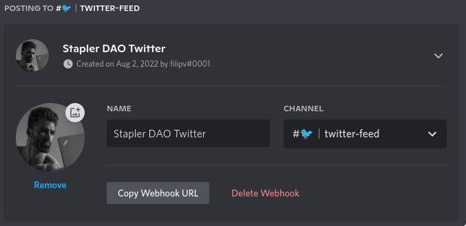

# Discord for DAOs

## 1. Server Template

Open the [Discord for DAOs template](https://discord.new/qsCbV9HGreJU)—channels, roles, permissions, and server settings will be pre-configured.


<p class="subtitle">Name your server and upload a logo.</p>

You will be brought to your new Discord server! Acquaint yourself with the preconfigured channels and roles:

### 1.1 Channels

|Category|Description|Channels|
|-|-|-|
|**Information**|These read-only channels provide basic information and important updates for the community.|✨｜read-me<br/>📢｜announcements<br/>🐦｜twitter-feed<br/>🔗｜links|
|**Public**|A space for the community to interact and engage.|🌞｜gm<br/>💬｜general<br/>🗣｜off-topic<br/>👋｜introductions<br/>❓｜questions<br/>💌｜suggestions|
|**Governance**|Formal decision making and consensus.|🏛｜read-me<br/>⚙｜workshop<br/>📜｜proposals|
|**Contributors**|A space for contributors to collaborate and build in the open. Each channel in this category corresponds with a role which can be granted to contributors (or self-assigned). Tailor these focus areas to your community's goals.|💬｜contributors<br/>💻｜developers<br/>👪｜community-management<br/>👀｜visibility<br/>🏛｜governance<br/>✨｜onboarding<br/>💸｜finances<br/>🤝｜partnerships|
|**Voice Channels**|Voice/video discussion.|🏛｜Town Hall<br/>🎤｜General<br/>🎤｜General 2|
|**Admin**|Private communications channels for administrators and moderators.|admin<br/>Admin|

### 1.2 Roles

|Role|Description|Permissions|
|-|-|-|
|**Admin**|Full-access administrator. Exercise caution when granting this role to others.|Administrative access to all permissions.|
|**Moderator**|Community moderators with elevated positions.|Permission to kick/ban users and delete messages, among other things. Moderators cannot reconfigure the server.|
|**Bots**|Cosmetic role to visually distinguish bots.|No permissions. Discord bots create and manage their own roles.|
|**Announcements**|An opt-in role for announcement notifications.|No permissions.|
|**Developer, Community Management, Visibility, Governance, Onboarding, Finances, and Partnerships**|Cosmetic roles to visually distinguish contributors to specific focus areas.|No permissions.|
|**@everyone**|Default role granted to all server members.|This role grants basic permissions necessary to participate in the server.|

### 1.3 Notes on Permissions

Discord permissions are *cumulative*—users gain permissions from all of their roles, with positive permissions overriding negative ones. Channel permissions and category permissions behave differently; they override the permissions of users and roles within specific channels. The [Discord for DAOs template](https://discord.new/qsCbV9HGreJU) comes with sensible defaults: non-admin users will not be able to send messages or create discussion threads within information/announcement channels.

To test a role's permissions, click on your server's name (at the top of your channels list), and navigate to your `Server Settings`. Navigate to the `Roles` page, and click on the role you would like to test. Within the `Display` tab, scroll to the bottom and select `View Server as Role →`. This will let you test what actions the role can take and what channels it can see.

## 2. Server Settings

Click on your server's name (at the top of your channels list), and navigate to your `Server Settings`. The [Discord for DAOs template](https://discord.new/qsCbV9HGreJU) comes with sensible defaults, but you may desire to reconfigure the following options:

|Setting|Sidebar Menu|Description|
|-|-|-|
|**Show Boost progress bar**|Overview|When enabled, a server boost progress bar will display in your channel list. Server boosts allow for further customization.|
|**Upload Emoji**|Emoji|Add custom emojis that anyone can use in your server.|
|**Upload Sticker**|Stickers|Add custom stickers that anyone can use in your server.|
|**Verification level**|Safety Setup|The criteria users must meet before they can send messages.|
|**Enable 2FA Requirement**|Safety Setup|Require members with moderation powers to have two-factor authentication enabled. This setting is recommended.|

## 3. React Roles and Embeds

*React roles* allow server members to easily self-assign roles by reacting to a message. The Discord bot [carl.gg](https://carl.gg) allows server owners to set up react roles, write custom embeds, and configure automod features if desired. To add carl.gg to your server:

1. Visit [carl.gg](https://carl.gg), sign in with your Discord account, and click `Manage` on the home page.
2. Select your server in this menu. You will be redirected to a Discord authentication page. Click `Continue`, then scroll down and click `Authorize`. You may need to fill out a captcha.
3. You will be redirected back to [carl.gg](https://carl.gg). Click `SKIP` to open your dashboard.

### 3.1 Your "README"

1. Open your server's [carl.gg dashboard](https://carl.gg/dashboard/).
2. Open the `Reaction roles` page in the sidebar. Click `Create new reaction role`.
3. In the Mode category, select `Post embed` and select your `#✨｜read-me` channel. Then click `Show embed builder`.

Type a brief server intro using the `Title` and the `Description` fields. This message will be the first thing users see when they join your Discord server. You can format this message with [markdown](https://www.markdownguide.org/cheat-sheet/).

**The title:**
```text
Welcome to the Stapler DAO Discord server!
```

**With the description:**
```text
Stapler DAO is disrupting the stapler industry with groundbreaking blockchain technology.

If you have questions, visit our [website](http://info.cern.ch/).

Click the 📢 for announcement notifications!
```

**Will be formatted like so:**


Once your message is written, click `Add emoji`, select the loudspeaker emoji, and select the announcements role. Users that click the loudspeaker will now be notified when you tag the `@announcements` role. Click `Create` to publish your message.

### 3.2 Contributor Roles

1. Open your server's [carl.gg dashboard](https://carl.gg/dashboard/).
2. Open the `Reaction roles` page in the sidebar. Click `Create new reaction role`.
3. In the Mode category, select `Post embed` and select your `#✨｜read-me` channel. Then click `Show embed builder`.
Fill out the `Title` and `Description` fields with a brief description of your contributor roles.

**The title:**
```text
React to receive contributor roles!
```

**With the description:**
```text
💻・Developer
👪・Community Management
👀・Visibility
🏛️・Governance
🛹・Onboarding
💸・Finances
🤝・Partnerships
```

**Will be formatted like so:**




Once your message is written, click `Add emoji` to add reaction emojis and their corresponding roles. These should be added one at a time, with each emoji corresponding to one role:



Click `Create` to publish your message.

### 3.3 Links Embed

A links embed will guide your community to DAO's resources and websites. To create one:
1. Open your server's [carl.gg dashboard](https://carl.gg/dashboard/). Open the `Embeds` page in the sidebar.
2. Fill out the `Title` field—*Stapler DAO Links*, for example.
3. Add your links to the `Description` field, formatted in [markdown](https://www.markdownguide.org/cheat-sheet/). An input of `[Juicebox Docs](https://info.juicebox.money)` will be formatted to: [Juicebox Docs](https://info.juicebox.money). If you have many links, you may want to separate them with bolded category titles. An input of `**Example Text**` will be formatted to: **Example Text**.
4. Select your `#🔗｜links` channel in the `Destination` field. Click `Post` to publish your links embed.

## 4. Twitter Feed

[IFTTT](https://ifttt.com/) allows you to create simple automations for popular web services. IFTTT's free plan will allow you to create a live Twitter feed in your Discord server:

1. Open your server's settings and open the `Integrations` page.
2. Click `Create Webhook`. Assign a screen name and profile picture here. Assign this integration to the `#🐦｜twitter-feed` channel.



<p class="subtitle">An example webhook configuration</p>

3. In a new tab, open [IFTTT](https://ifttt.com). If you do not already have an account, [create one at ifttt.com/join](https://ifttt.com/join).
4. Sign in to IFTTT and navigate to [ifttt.com/create](https://ifttt.com/create).
5. Click `Add` next to *If This* and select the `Twitter` service. Select the `New tweet by you` trigger.
6. Add your Twitter account and select it. If desired, you can include retweets and @replies. Click `Create trigger`.
7. Click `Add` next to *Then That* and select the `Webhooks` service. Select the `Make a web request` action.
8. Open your webhook in your server's settings, and click `Copy Webhook URL`. Paste this URL in IFTTT's `URL` field.
9. Select `POST` as your Method. Select `application/json` as your Content Type. Paste this into the Body field:
```json
{ "content":"{{LinkToTweet}}" }
```
10. Click `Create action`, `Continue`, and `Finish`.

**The Tweet:**


**Will be rendered like so:**


## 5. Next Steps

You are done! Optionally:
- To enable features like discovery, server metrics, and a welcome screen, navigate to the `Enable Community` page in your server settings and click `Get Started`.
- Add new categories and channels for different languages.
- Add new reaction roles with [carl.gg](https://carl.gg).
